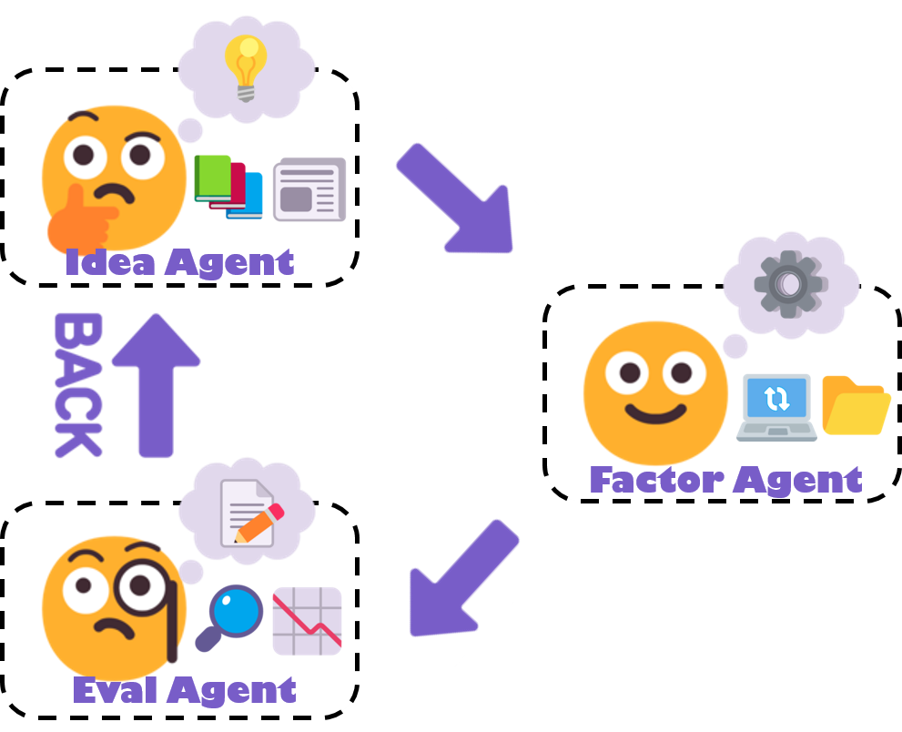

<h4 align="center">
  
  
  <!-- <a href="https://arxiv.org/abs/2502.16789"><b>📃Paper Link</b>👁️</a> -->
</h3>

Official source code of KDD 2025 paper: [AlphaAgent: LLM-Driven Alpha Mining with Regularized Exploration to Counteract Alpha Decay](https://arxiv.org/abs/2502.16789)


# 📖Introduction
<div align="center">
      
</div>


<!-- Tag Cloud -->
**AlphaAgent** is an autonomous framework that effectively integrates LLM agents for mining interpretable and decay-resistant alpha factors through three specialized agents.  

- **Idea Agent**: Proposes market hypotheses to guide factor creation based on financial theories or emerging trends.  
- **Factor Agent**: Constructs factors based on hypotheses while incorporating regularization mechanisms to avoid duplication and overfitting. 
- **Eval Agent**: Validates practicality, performs backtesting, and iteratively refines factors via feedback loops.

This repository follows the implementation of [RD-Agent](https://github.com/microsoft/RD-Agent). You can find its repository at: [https://github.com/microsoft/RD-Agent](https://github.com/microsoft/RD-Agent). We would like to extend our sincere gratitude to the RD-Agent team for their pioneering work and contributions to the community.


# ⚡ Quick start

### 🐍 Create a Conda Environment
- Create a new conda environment with Python (3.10 and 3.11 are well-tested in our CI):
  ```sh
  conda create -n alphaagent python=3.10
  ```
- Activate the environment:
  ```sh
  conda activate alphaagent
  ```

### 🛠️ Install locally
- 
  ```sh
  # Install AlphaAgent
  pip install -e .
  ```

### 📈 Data Preparation
- First, clone Qlib source code for runing backtest locally.
  ```
  # Clone Qlib source code
  git clone https://github.com/microsoft/qlib.git
  cd qlib
  pip install .
  cd ..
  ```

- Then, mannully download Chinese stock data via baostock and dump into the Qlib format.
  ```sh
  # Download or update stock data from 2015-01-01 until NOW from baostock
  python prepare_sh_sp500_qlib.py

  cd qlib

  # Convert csv to Qlib format. Check correct paths before runing. 
  python scripts/dump_bin.py dump_all ... \
  --include_fields open,high,low,close,preclose,volume,amount,turn,factor \
  --csv_path  ~/.qlib/qlib_data/sh_sp500_qlib/raw_data_now \
  --qlib_dir ~/.qlib/qlib_data/sh_sp500_qlib \
  --date_field_name date \
  --symbol_field_name code

  # Collect calendar data
  python scripts/data_collector/future_calendar_collector.py --qlib_dir ~/.qlib/qlib_data/sh_sp500_qlib/ --region cn


  # Download the CSI500/CSI300/CSI100 stock universe
  python scripts/data_collector/cn_index/collector.py --index_name CSI500 --qlib_dir ~/.qlib/qlib_data/sh_sp500_qlib/ --method parse_instruments
  ```


- Alternatively, stock data (out-dated) will be automatically downloaded to `~/.qlib/qlib_data/sh_sp500_qlib`.


- You can modify backtest configuration files which are located at:
  - Baseline: `alphaagent/scenarios/qlib/experiment/factor_template/conf.yaml`
  - For Newly proposed factors: `alphaagent/scenarios/qlib/experiment/factor_template/conf_cn_combined.yaml`
  - For changing train/val/test periods, first remove all cache files in `./git_ignore_folder` and `./pickle_cache`. 
  - For changing the market, remove cache files in `./git_ignore_folder`, `./pickle_cache`. Then, delete `daily_pv_all.h5` and `daily_pv_debug.h5` in directory `alphaagent/scenarios/qlib/experiment/factor_data_template/`. 


### ⚙️ Configuration
- For OpenAI compatible API, ensure both `OPENAI_BASE_URL` and `OPENAI_API_KEY` are configured in the `.env` file.
- `REASONING_MODEL` is used in the idea agent and factor agent, while `CHAT_MODEL` is for debugging factors and generating feedbacks.
- Slow-thinking models, such as o3-mini are preferred for the `REASONING_MODEL`.
- To run the project in a local environment (instead of Docker), add `USE_LOCAL=True` to the `.env` file.


### 🚀 Run AlphaAgent
- Run **AlphaAgent** based on [Qlib Backtesting Framework](http://github.com/microsoft/qlib).
  ```sh
  alphaagent mine --potential_direction "<YOUR_MARKET_HYPOTHESIS>"
  ```

- Alternatively, run the following command
  ```sh
  dotenv run -- python alphaagent/app/qlib_rd_loop/factor_alphaagent.py --direction "<YOUR_MARKET_HYPOTHESIS>"
  ```
  After running the command, log out and log back in for the changes to take effect. 

- Multi-factor backtesting
  ```sh
  alphaagent backtest --factor_path "<PATH_TO_YOUR_CSV_FILE>"
  ```

  Your factors need to be stored in a `.csv` file. Here is an example:
  ```csv
  factor_name,factor_expression
  MACD_Factor,"MACD($close)"
  RSI_Factor,"RSI($close)"
  ```


- If you need to rerun the baseline results or update backtest configs, remove the cache folders:
  ```sh
  rm -r ./pickle_cache/*
  rm -r ./git_ignore_folder/*
  ```

### 🖥️ Monitor the Application Results
- You can run the following command for our demo program to see the run logs. Note than the entrance is deprecated. 
  ```sh
  alphaagent ui --port 19899 --log_dir log/
  ```


### 📚 Citation
If you find this work helpful, please cite our paper:
```bibtex
@misc{tang2025alphaagentllmdrivenalphamining,
      title={AlphaAgent: LLM-Driven Alpha Mining with Regularized Exploration to Counteract Alpha Decay}, 
      author={Ziyi Tang and Zechuan Chen and Jiarui Yang and Jiayao Mai and Yongsen Zheng and Keze Wang and Jinrui Chen and Liang Lin},
      year={2025},
      eprint={2502.16789},
      archivePrefix={arXiv},
      primaryClass={cs.CE},
      url={https://arxiv.org/abs/2502.16789}, 
}
```
